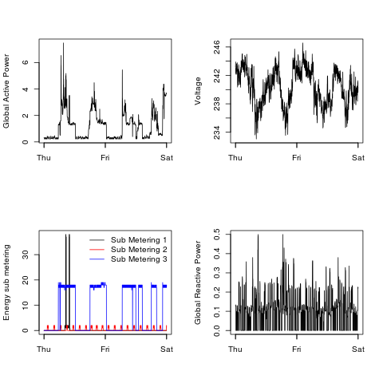

## Introduction

This assignment uses data from
the <a href="http://archive.ics.uci.edu/ml/">UC Irvine Machine
Learning Repository</a>, a popular repository for machine learning
datasets. In particular, we will be using the "Individual household
electric power consumption Data Set" which I have made available on
the course web site:

* <b>Dataset</b>: <a href="https://d396qusza40orc.cloudfront.net/exdata%2Fdata%2Fhousehold_power_consumption.zip">Electric power consumption</a> [20Mb]

* <b>Description</b>: Measurements of electric power consumption in
one household with a one-minute sampling rate over a period of almost
4 years. Different electrical quantities and some sub-metering values
are available.

The following descriptions of the 9 variables in the dataset are taken
from
the <a href="https://archive.ics.uci.edu/ml/datasets/Individual+household+electric+power+consumption">UCI
web site</a>:

<ol>
<li><b>Date</b>: Date in format dd/mm/yyyy </li>
<li><b>Time</b>: time in format hh:mm:ss </li>
<li><b>Global_active_power</b>: household global minute-averaged active power (in kilowatt) </li>
<li><b>Global_reactive_power</b>: household global minute-averaged reactive power (in kilowatt) </li>
<li><b>Voltage</b>: minute-averaged voltage (in volt) </li>
<li><b>Global_intensity</b>: household global minute-averaged current intensity (in ampere) </li>
<li><b>Sub_metering_1</b>: energy sub-metering No. 1 (in watt-hour of active energy). It corresponds to the kitchen, containing mainly a dishwasher, an oven and a microwave (hot plates are not electric but gas powered). </li>
<li><b>Sub_metering_2</b>: energy sub-metering No. 2 (in watt-hour of active energy). It corresponds to the laundry room, containing a washing-machine, a tumble-drier, a refrigerator and a light. </li>
<li><b>Sub_metering_3</b>: energy sub-metering No. 3 (in watt-hour of active energy). It corresponds to an electric water-heater and an air-conditioner.</li>
</ol>

## How to load the data

The `read_data.R` contains the common code to load the data into R.

        source("./read_data.R")
        hpc_data <- read_data()
        
It does the following:

* Loads the entire dataset into a dataframe
* Converts it to data.table
* Filters the dates 2007-02-01 and 2007-02-02 date related data
* Add a Datetime field to the data.table class POSTXct

## Creating plots

There are 4 R files which create 1 png file each

 R File  | Plot (png)
---------|-----------
`plot1.R`|`plot1.png`
`plot2.R`|`plot2.png`
`plot3.R`|`plot3.png`
`plot4.R`|`plot4.png`

### Usage
        
        source("./plot1.R")
        source("./plot2.R")
        source("./plot3.R")
        source("./plot4.R")

Our overall goal here is simply to examine how household energy usage
varies over a 2-day period in February, 2007. Task was to
reconstruct the following plots below, all of which were constructed
using the base plotting system.

The four plots have been re-construct are shown below. 

### Plot 1

Orignal  | Re-construct by plot1.R
---------|-----------
 | 

### Plot 2

Orignal  | Re-construct by  plot2.R
---------|-----------
 | 

### Plot 3

Orignal  | Re-construct by  plot3.R
---------|-----------
 | 

### Plot 4

Orignal  | Re-construct by  plot4.R
---------|-----------
 | 

